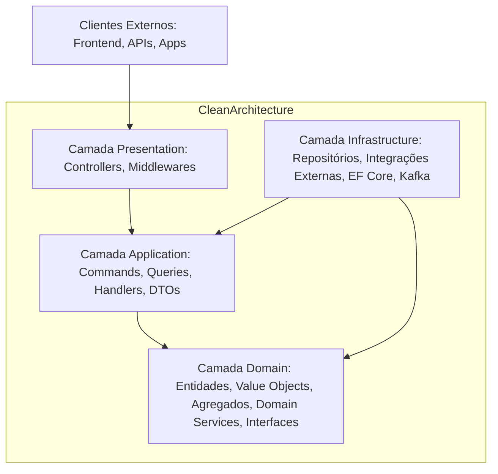

# Crypto AI Platform — Regras de Arquitetura

## Objetivo
Este documento define as regras de arquitetura obrigatórias para todo o desenvolvimento da Crypto AI Platform. Qualquer decisão técnica ou implementação que não siga estas regras NÃO SERÁ APROVADA na revisão de código!
Estas regras são não-negotiáveis para garantir que a plataforma seja escalável, resiliente, segura, testável, observável e fácil de manter, de acordo com os princípios de Clean Architecture, Domain-Driven Design (DDD) e SOLID.

## Índice
1. [Regras Geral de Organização do Código](#1-regras-geral-de-organização-do-código)
2. [Regras de Camadas da Clean Architecture](#2-regras-de-camadas-da-clean-architecture)
3. [Regras de Domain-Driven Design (DDD)](#3-regras-de-domain-driven-design-ddd)
4. [Regras de CQRS e MediatR](#4-regras-de-cqrs-e-mediatr)
5. [Regras de Banco de Dados](#5-regras-de-banco-de-dados)
6. [Regras de Mensageria (Kafka)](#6-regras-de-mensageria-kafka)
7. [Regras de APIs](#7-regras-de-apis)
8. [Regras de Observabilidade](#8-regras-de-observabilidade)
9. [Regras de Segurança](#9-regras-de-segurança)
10. [Regras de Testes](#10-regras-de-testes)

---

## 1. Regras Geral de Organização do Código

| ID | Regra | Tipo | Severidade |
|----|-------|------|------------|
| RULE-ORG-001 | Todo o código da plataforma deve ser organizado no monorepo descrito no PROJECT_CONTEXT.md. | Estrutura | 🔴 Crítica |
| RULE-ORG-002 | Nenhum arquivo deve ter mais de 500 linhas de código (excluindo comentários e imports). Se um arquivo ficar maior, refatore em múltiplos arquivos menores. | Qualidade | 🟠 Alta |
| RULE-ORG-003 | Nenhum método ou função deve ter mais de 100 linhas de código. Se um método ficar maior, divida em funções/métodos menores e com responsabilidade única. | Qualidade | 🟠 Alta |
| RULE-ORG-004 | Nenhum componente (classe, função) deve ter mais de 7 dependências injetadas. Se tiver mais de 7, refatore o componente para seguir o Single Responsibility Principle (SRP). | Arquitetura | 🟠 Alta |
| RULE-ORG-005 | Todo código-fonte deve ser formatado usando as ferramentas padrão da linguagem (dotnet format para C#, Prettier + ESLint para TypeScript). Nenhum código com formatação inconsistente será aprovado. | Qualidade | 🟡 Média |

---

## 2. Regras de Camadas da Clean Architecture
A Clean Architecture é a base da nossa arquitetura. As seguintes regras são OBRIGATÓRIAS:

| ID | Regra | Justificativa | Severidade |
|----|-------|---------------|------------|
| RULE-CLEAN-001 | A Camada de Domínio (Domain) NÃO PODE ter dependências de nenhuma outra camada (Application, Infrastructure, Presentation) nem de frameworks externos (como Entity Framework, ASP.NET Core, MediatR, etc.). A única dependência permitida é a biblioteca de runtime padrão da linguagem. | Garante que as regras de negócio do domínio sejam puras, testáveis e desacopladas de detalhes de infraestrutura. | 🔴 Crítica |
| RULE-CLEAN-002 | A Camada de Aplicação (Application) SÓ PODE depender da Camada de Domínio. Não pode depender de Infrastructure ou Presentation. | Garante que a lógica de orquestração seja desacoplada de detalhes de infraestrutura e interface. | 🔴 Crítica |
| RULE-CLEAN-003 | A Camada de Infraestrutura (Infrastructure) PODE depender da Camada de Aplicação e da Camada de Domínio. É onde as interfaces definidas nas camadas internas são implementadas. | Implementa detalhes de tecnologia sem impactar as regras de negócio. | 🟢 Baixa |
| RULE-CLEAN-004 | A Camada de Apresentação (Presentation) PODE depender de Application e Infrastructure. É onde as controllers APIs, middlewares e configuração de injeção de dependência (DI) residem. | É o ponto de entrada para os clientes externos (frontend, apps, etc.). | 🟢 Baixa |
| RULE-CLEAN-005 | Interfaces para serviços externos (ex: `IExchangeIntegrationService`, `INotificationService`) DEVEM ser definidas na Camada de Domínio ou na Camada de Aplicação. As implementações concretas DEVEM ficar na Camada de Infrastructure. | Segue o Dependency Inversion Principle (DIP) do SOLID: dependa de abstrações, não de concretizações. | 🔴 Crítica |

### Exemplo Visual da Clean Architecture (Mermaid)

---

## 3. Regras de Domain-Driven Design (DDD)
As regras de DDD são obrigatórias para a Camada de Domínio:

| ID | Regra | Justificativa | Severidade |
|----|-------|---------------|------------|
| RULE-DDD-001 | Todo Agregado DEVE ter uma única Entidade como Agregado Raiz (Aggregate Root). Nenhuma outra Entidade fora do Agregado pode acessar diretamente entidades internas — todas as interações passam pelo Agregado Raiz. | Garante consistência transacional e invariantes do agregado. | 🔴 Crítica |
| RULE-DDD-002 | Todos os Value Objects DEVEM ser imutáveis (readonly / init no C#, const / readonly no TypeScript). A igualdade de Value Objects DEVE ser determinada pelos valores dos atributos, não por identidade. | Os Value Objects são definidos por seus valores, não por sua identidade. | 🔴 Crítica |
| RULE-DDD-003 | Todo Agregado Raiz DEVE garantir que todas as invariantes de negócio sejam válidas em todos os momentos (invariantes = regras que NÃO PODEM ser quebradas nunca). | Garante que o domínio sempre esteja em um estado consistente. | 🔴 Crítica |
| RULE-DDD-004 | Todo evento significativo no domínio DEVE ser representado como um Domain Event (nome em pretérito: `StrategyCreatedEvent`, `OrderExecutedEvent`, `RiskLimitReachedEvent`). | Permite que outros componentes reajam a mudanças no domínio de forma desacoplada. | 🟠 Alta |
| RULE-DDD-005 | Domain Events DEVEM ser levantados (raised) pelo Agregado Raiz e NÃO diretamente por outros componentes. | Garante que os eventos representem mudanças válidas no estado do agregado. | 🟠 Alta |

---

## 4. Regras de CQRS e MediatR

| ID | Regra | Justificativa | Severidade |
|----|-------|---------------|------------|
| RULE-CQRS-001 | Toda operação que modifica o estado do sistema DEVE ser implementada como um Command usando MediatR. | Segrega responsabilidades de leitura e escrita. | 🟠 Alta |
| RULE-CQRS-002 | Toda operação que apenas lê dados do sistema DEVE ser implementada como uma Query usando MediatR. | Segrega responsabilidades de leitura e escrita. | 🟠 Alta |
| RULE-CQRS-003 | Commands NÃO DEVEM retornar dados complexos — se necessário, retornar apenas o ID da entidade criada/modificada, ou `Unit` (tipo vazio do MediatR). | Commands são sobre ações, não sobre consultas. | 🟡 Média |
| RULE-CQRS-004 | Queries NÃO DEVEM modificar o estado do sistema (side-effect free). | Queries são sobre leitura, não sobre mudança de estado. | 🔴 Crítica |
| RULE-CQRS-005 | Pipeline Behaviors do MediatR DEVEM ser usados para cross-cutting concerns (logging, validação, transações, etc.), e não diretamente no Handler. | Evita duplicação de código em Handlers. | 🟡 Média |
| RULE-CQRS-006 | Todo Command DEVE ter um validador usando FluentValidation. A validação DEVE acontecer antes do Handler principal (usando Pipeline Behavior). | Valida a entrada antes de executar a lógica de negócio. | 🟠 Alta |

---

## 5. Regras de Banco de Dados

| ID | Regra | Justificativa | Severidade |
|----|-------|---------------|------------|
| RULE-DB-001 | Todo acesso a dados relacional DEVE ser feito usando Entity Framework Core 9. NÃO são permitidos ADO.NET bruto ou ORMs alternativos sem aprovação explícita do Arquiteto Chefe. | Padroniza o acesso a dados e garante consistência. | 🔴 Crítica |
| RULE-DB-002 | Migrações de banco de dados DEVEM ser criadas usando `dotnet ef migrations add` e NÃO PODEM ser editadas manualmente após a criação. | Evita problemas de inconsistência e quebrar ambientes. | 🔴 Crítica |
| RULE-DB-003 | Todas as tabelas DEVEM ter uma coluna `Id` como chave primária (GUID no C#). | Padroniza a identificação de entidades. | 🟠 Alta |
| RULE-DB-004 | Toda tabela DEVEM ter colunas de auditoria: `CreatedAt` (datetime, não nulo, definido na criação), `UpdatedAt` (datetime, atualizado na modificação), `CreatedBy` (GUID userId, opcional), `UpdatedBy` (GUID userId, opcional). | Garante auditabilidade de todas as mudanças. | 🔴 Crítica |
| RULE-DB-005 | Índices DEVEM ser criados para todas as colunas usadas em `WHERE`, `JOIN`, `ORDER BY` frequentes, para otimizar performance de consultas. | Melhora performance das Queries CQRS. | 🟡 Média |
| RULE-DB-006 | Cache com Redis DEVE ser usado para dados frequentemente acessados e que não mudam com frequência (ex: dados de mercado recentes, sessões de usuário). | Melhora performance e reduz carga no banco de dados principal. | 🟡 Média |
| RULE-DB-007 | Outbox Pattern DEVE ser usado para publicar eventos no Kafka de forma confiável (tabela `Outbox` na mesma transação que as mudanças no agregado). | Garante que os eventos não são perdidos em caso de falha. | 🔴 Crítica |

---

## 6. Regras de Mensageria (Kafka)

| ID | Regra | Justificativa | Severidade |
|----|-------|---------------|------------|
| RULE-KAFKA-001 | Todo evento publicado no Kafka DEVE ter um schema registrado no Confluent Schema Registry (formato Avro ou Protobuf). | Garante compatibilidade entre produtores e consumidores. | 🟠 Alta |
| RULE-KAFKA-002 | Nomes de tópicos DEVEM seguir o padrão: `cryptoai.<modulo>.<evento>`. Ex: `cryptoai.strategies.StrategyCreatedEvent`, `cryptoai.orders.OrderExecutedEvent`. | Padroniza o nome de tópicos para facilitar a governança. | 🟠 Alta |
| RULE-KAFKA-003 | Todos os consumers DEVEM ser idempotentes (processar a mesma mensagem múltiplas vezes sem causar efeitos colaterais indesejados). | Garante que a mesma mensagem não cause problemas se for entregue mais de uma vez (Kafka tem entrega "at least once"). | 🔴 Crítica |
| RULE-KAFKA-004 | Tópicos DEVEM ser particionados para permitir paralelismo no consumo (número de partições recomendado: igual ao número de replicas ou múltiplo do número de consumers). | Melhora escalabilidade do consumo de eventos. | 🟡 Média |

---

## 7. Regras de APIs

| ID | Regra | Justificativa | Severidade |
|----|-------|---------------|------------|
| RULE-API-001 | Todas as APIs REST DEVEM seguir o padrão RESTful e usar versionamento semântico na URL (ex: `/api/v1/strategies`, `/api/v2/orders`). | Permite evoluir as APIs sem quebrar clientes antigos. | 🟠 Alta |
| RULE-API-002 | Todas as APIs DEVEM usar autenticação via JWT (JSON Web Token) com chaves assimétricas (RS256). | Garante segurança da autenticação. | 🔴 Crítica |
| RULE-API-003 | Todas as APIs DEVEM ter rate limiting implementado. | Previne abusos e ataques DDoS. | 🔴 Crítica |
| RULE-API-004 | Todas as respostas de erro DEVEM seguir um formato padrão, com código HTTP adequado, mensagem de erro e correlation ID para tracing. | Facilita o debug e o tratamento de erros nos clientes. | 🟠 Alta |
| RULE-API-005 | Todas as APIs DEVEM ter uma documentação OpenAPI/Swagger auto-gerada e publicada. | Facilita o uso das APIs por clientes internos e externos. | 🟡 Média |

---

## 8. Regras de Observabilidade

| ID | Regra | Justificativa | Severidade |
|----|-------|---------------|------------|
| RULE-OBS-001 | Todo componente DEVE ser instrumentado com OpenTelemetry para logs, métricas e tracing distribuído. | Garante que a plataforma seja 100% observável. | 🔴 Crítica |
| RULE-OBS-002 | Todos os logs DEVEM ser estruturados em JSON e incluir pelo menos: `timestamp`, `serviceName`, `traceId`, `spanId`, `level`, `message`, `userId` (quando aplicável). | Facilita a indexação e consulta de logs em ferramentas como Elasticsearch/Grafana Loki. | 🟠 Alta |
| RULE-OBS-003 | Todo componente DEVE emitir métricas customizadas importantes (contadores, gauges, histograms) para Prometheus. | Permite monitorar o estado do sistema em tempo real. | 🟠 Alta |
| RULE-OBS-004 | Todo request HTTP e chamada a serviços externos DEVEM propagar o trace ID usando W3C Trace Context (headers `traceparent` e `tracestate`). | Permite tracing distribuído entre serviços. | 🔴 Crítica |

---

## 9. Regras de Segurança

| ID | Regra | Justificativa | Severidade |
|----|-------|---------------|------------|
| RULE-SEC-001 | NÃO PODEM haver segredos (senhas, chaves API, certificados, strings de conexão) em texto claro em código-fonte, arquivos de configuração, ou logs. Segredos DEVEM ser gerenciados via HashiCorp Vault / AWS Secrets Manager / Azure Key Vault e injetados via variáveis de ambiente. | Evita vazamento acidental de segredos. | 🔴 Crítica |
| RULE-SEC-002 | Todo o tráfego de rede (interno e externo) DEVE ser criptografado usando TLS 1.3 (TLS 1.2 como fallback). | Evita interceptação de dados em trânsito. | 🔴 Crítica |
| RULE-SEC-003 | Todas as entradas de usuário DEVEM ser validadas e sanitizadas para evitar injeções (SQL Injection, XSS, NoSQL Injection, Command Injection). | Previne vulnerabilidades de segurança OWASP Top 10. | 🔴 Crítica |
| RULE-SEC-004 | Senhas de usuários DEVEM ser armazenadas usando bcrypt com work factor ≥ 12 (ou Argon2, se implementado). | Armazena senhas de forma segura e resistente a ataques de brute-force. | 🔴 Crítica |
| RULE-SEC-005 | Todas as APIs DEVEM ter cabeçalhos de segurança configurados: `Content-Security-Policy`, `X-Content-Type-Options`, `X-Frame-Options`, `X-XSS-Protection`, `Strict-Transport-Security` (HSTS). | Previne várias vulnerabilidades de segurança no navegador. | 🟠 Alta |

---

## 10. Regras de Testes

| ID | Regra | Justificativa | Severidade |
|----|-------|---------------|------------|
| RULE-TEST-001 | Todo código novo DEVE ter testes unitários. A meta é pelo menos 80% de cobertura de código para as Camadas de Domínio e Aplicação. | Garante que as regras de negócio estão funcionando corretamente. | 🔴 Crítica |
| RULE-TEST-002 | Testes de integração DEVEM ser criados para integrações com bancos de dados, Kafka, APIs de exchanges, etc. | Garante que as integrações estão funcionando corretamente. | 🟠 Alta |
| RULE-TEST-003 | Testes E2E (End-to-End) usando Playwright DEVEM ser criados para as funcionalidades principais da plataforma (login, criação de estratégia, backtesting, live trading básico). | Garante que a plataforma funciona como um todo para o usuário final. | 🟡 Média |
| RULE-TEST-004 | NENHUM código que quebre testes existentes deve ser mergeado na branch principal. | Evita regressões (bugs que voltam após correção). | 🔴 Crítica |

---

## Histórico de Versões
| Versão | Data | Autor | Descrição |
|--------|------|-------|-----------|
| v1.0 | 2026-06-24 | Equipe de Arquitetura | Versão inicial do documento. |
